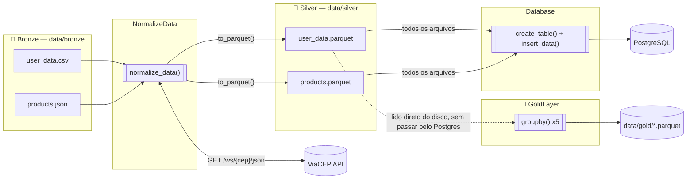

# simple-etl

Pipeline **ETL** em Python que extrai dados de múltiplas fontes (CSV, JSON e uma API externa), trata e enriquece esses dados, carrega em um banco **PostgreSQL** e gera uma camada analítica com agregações — seguindo a arquitetura **Medalhão (Bronze → Silver → Gold)**.

Projeto de estudo/portfólio, construído para demonstrar na prática extração, transformação, carga e modelagem analítica de dados.

`Python 3` · `pandas` · `PostgreSQL 16` · `Docker` · `ViaCEP API`


## Sobre o projeto

O pipeline parte de um cadastro de usuários (CSV) e um catálogo de produtos (JSON), trata e remove dados duplicados, **enriquece o cadastro com dados de endereço consultando a API pública [ViaCEP](https://viacep.com.br/)** a partir do CEP de cada usuário, salva o resultado em Parquet, carrega tudo em um banco relacional e, por fim, calcula métricas de negócio (usuários por estado/cidade, idade média, distribuição por profissão e sexo).

### O que este projeto demonstra

- Modelagem de pipeline de dados em camadas (**Bronze / Silver / Gold**)
- Consumo de API externa com **retry, backoff e tratamento de erros** por tipo de falha (timeout, HTTP, conexão)
- Escrita/leitura em **Parquet** e carga em **PostgreSQL**
- Design orientado a objetos separando responsabilidades (`ConsultaAPI`, `NormalizeData`, `Database`, `GoldLayer`)
- Ambiente reprodutível com **Docker Compose** e variáveis de ambiente (`.env`)
- Logging estruturado das execuções (`etl.log`)

## Arquitetura




## Estrutura do projeto

```
simple-etl/
├── data/
│   ├── bronze/              # dados brutos (CSV, JSON)
│   ├── silver/              # dados tratados e enriquecidos (Parquet)
│   └── gold/                # agregações analíticas (Parquet)
├── src/
│   ├── client_api.py        # cliente da API ViaCEP (retry, backoff, logging)
│   ├── normalize_data.py    # normalização e enriquecimento (Bronze -> Silver)
│   ├── database.py          # acesso ao PostgreSQL (criação de tabelas e insert)
│   └── gold_layer.py        # agregações analíticas (Silver -> Gold)
├── main.py                  # orquestra o pipeline completo
├── docker-compose.yml       # sobe o PostgreSQL usado no projeto
├── requirements.txt
└── .env.example
```

## Como executar

### 1. Pré-requisitos
- Python 3.10+
- Docker e Docker Compose

### 2. Configurar variáveis de ambiente

```bash
cp .env.example .env
```

| Variável      | Descrição                          |
|---------------|-------------------------------------|
| `DB_HOST`     | host do PostgreSQL (`localhost`)   |
| `DB_PORT`     | porta exposta pelo docker-compose  |
| `DB_DATABASE` | nome do banco                      |
| `DB_USER`     | usuário do banco                   |
| `DB_PASSWORD` | senha do banco                     |

### 3. Subir o banco de dados

```bash
docker-compose up -d
```

### 4. Instalar as dependências

```bash
pip install -r requirements.txt
```

### 5. Rodar o pipeline

Um único comando executa o fluxo completo — Bronze → Silver (com enriquecimento via ViaCEP) → carga no PostgreSQL → agregações Gold:

```bash
python main.py
```

## Autor

Desenvolvido por [João Fernandes](https://github.com/JoaoFernandesXD) como projeto de estudo/portfólio.
